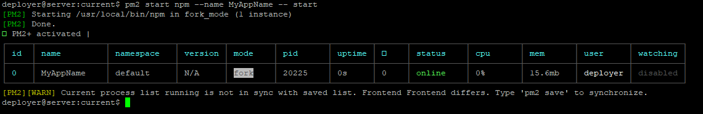
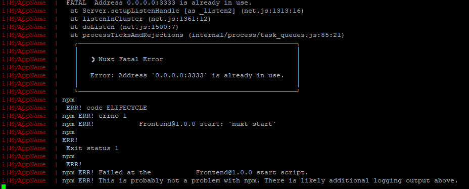
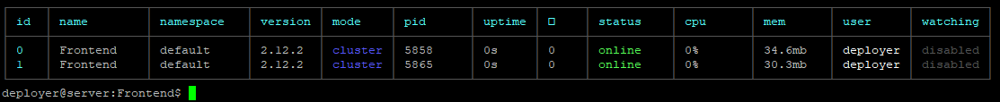
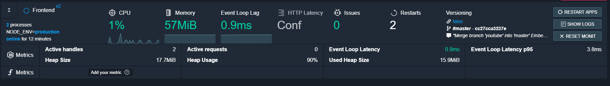

# Nuxt Zero Downtime Deployment Tutorial

I've recently came accross <a href="https://nuxtjs.org/" target="_blank">Nuxt.js</a>, a great framework for <a href="https://vuejs.org/" target="_blank">Vue.js</a>, that makes routing inside your website a breeze, but more importantly it's most important feature is Server Side Rendering (**SSR**), which helps with Search Engine Optimization (**SEO**) and delivers content to your users faster. 

Despite the popularity of the Nuxt, I still had quite a lot of trouble when setting it up with my own server for automatic deployment, due to lack of information/tutorials or outdated information. There are several ways to deploy Nuxt (or Vue) application, if your website doesn't contain any dynamic routs I recommend generating the static site wih `$ npm run generate` or `$ yarn generate`. Another option would be to log into your remote server, clone the repository (or copy the files) and then run `$ npm run build & $ npm run serve` or using yarn `$ yarn build & $ yarn serve`.

But what if we want to deploy automatically? Let's say we run our CI/CD pipeline, if the tests are passed, we want to clone/copy the code to the server and start it, preferably without any downtime. Then I recommend using <a href="https://pm2.keymetrics.io/" target="_blank">PM2</a>, a great process manager for Node.js application, that not only auto starts and manages our application but can also do load balancing through *cluster mode*. What cluster mode does, is basically creates multiple instances of our Node.js process and scale it across multiple CPUs, when we then reload a website, it goes one by one restarting an instance, therefore we achieve no-downtime deployment. 

Setting up the PM2 cluster mode is extremely easy and fast, however correct configuration needs to be set up in order to work with our nuxt application. 

### Setting it all up

First we need to install PM2, this can be done through npm or yarn.

```csharp
$ npm install pm2@latest -g
# or
$ yarn global add pm2
```

To start application through PM2, we first move to the application directory and run comnand:
```csharp
$ pm2 start npm --name MyAppName -- start
```
The job is started and we get the following result:



Running the command again, will for some reason show as fine in the `pm2 ls`, but checking the log (`pm2 log`), we can see that the second instance is unable to start.



The exact problem here being, that the port is already taken. We could theoretically run the new instance on new port, but this not a real solution. What we need to do is run the instance in cluster mode, but not only that, we need to lunch nuxt.js directly!

### Properly Configuration PM2
What we have to do is run PM2 in cluster mode but not through npm CLI, but rather directly starting the Nuxt server (`Nuxt start`). To do so, you need to point PM2 directly to where the script is located, this is in:
```bash
./node_modules/nuxt/bin/nuxt.js
```
It is important that you put the full name of the script (nuxt.js) in the command. To make things even easier, PM2 can be run by using configuration file called `ecosystem.config.js`. To create it, we simply run command:

```bash
pm2 init
```

And configure the file as such:

```bash
module.exports = {
  apps : [{
    name: 'Frontend',
    script: './node_modules/nuxt/bin/nuxt.js',
    args: 'start',
    exec_mode: 'cluster',
    instances: '2',
    cwd: './current',
    error_file: 'error_frontend.log',
    out_file: 'out_frontend.log',
    log_file: 'combined_frontend.log',
    time: true,
    env: {
        "HOST": '0.0.0.0',
        "PORT": 3333,
        "NODE_ENV": 'production',
        "dev": false
    }
  }]
};
```

The important part is the script and exec_mode. The name (apps) is the name of the config / run mode, you can have multiple configurations for let's say testing, or development environments. In my case I structure my project so

```markdown
/Frontend
|--/releases
|----/2020-04-16_15-00
|----/2020-04-15_12-00
|----/...
|--/current -> /releases/2020-04-16_15-00 (symlink)
|--ecosystem.config.js
```
That is why I have *cwd* settings set to `./current` to be run from the root of the nuxt project. Instances *2* means that PM2 will start *2* instances of my Nuxt app, if you wish to run maximum number of instances, depending on your CPU, you can set it to *max*

We can now try and start our application again, go to the directory with *ecosystem.config.js* and type:

```markdown
pm2 start
```


If we now run `pm2 log` we can see that there are no error this time.
Now, the only thing left to do, when we redeploy is to **reload** (**not restart!**) the instances:

```markdown
pm2 reload MyAppName
```


**This is it, we can now deploy our website with zero downtime. :+1:**

## Some other useful commads and info
* pm2 allows us to automatically start application on reboot, to do so you need to run:

```bash
# Detect available init system, generate configuration and enable startup system
$ pm2 startup

# To run the processes that you wish to start on boot
$ pm2 start

# When the processes are you can save the configuration by
$ pm2 save
```

* PM2 offers real time metric reporting, you can do so through <a href="# Detect available init system, generate configuration and enable startup system" target="_blank">app.pm2.io</a> To do so, you need to link the id provided on the app.pm2.io with your instance: `pm2 link 2x14141z7m3ew61 7q1414mlgergrlgspo37w`. With free account you can monitor up to 4 processes. 



* To hide working directory/server name on Ubuntu:
```bash
export PS1="\u > "
```
```markdown
*  \a     The 'bell' character
*  \A     24h Time
*  \d     Date (e.g. Tue Dec 21)
*  \e     The 'escape' character
*  \h     Hostname (up to the first ".")
*  \H     Hostname
*  \j     No. of jobs currently running (ps)
*  \l     Current tty
*  \n     Line feed
*  \t     Time (hh:mm:ss)
*  \T     Time (hh:mm:ss, 12h format)
*  \r     Carriage return
*  \s     Shell (i.e. bash, zsh, ksh..)
*  \u     Username
*  \v     Bash version
*  \V     Full Bash release string
*  \w     Current working directory
*  \W     Last part of the current working directory
*  \!     Current index in history
*  \#     Command index
*  \$     A "#" if you're root, else "$"
*  \\     Literal Backslash
*  \@     Time (12h format with am/pm)
```
* You can also use PM2 to start java or other applications

```csharp
module.exports = {
  apps : [{
    name: 'Java-Backend',
    cwd: ".",
	script: '/usr/bin/java',
    args: ["-jar", "/path/to/your/jar/file/SmartHome.jar"],
    instances: 1,
    autorestart: true,
    watch: false,
    max_memory_restart: '1G',
    exact_mode: "fork",
	error_file: 'java_backend_error.log',
    out_file: 'java_backend_out.log',
    log_file: 'java_backend_combined.log',
    time: true
  }]
};
```


## Documentation and resources
* Documentation about <a href="https://nuxtjs.org/guide/installation" target="_blank">Nuxt.js</a>
* Documentation about <a href="https://pm2.keymetrics.io/docs/usage/quick-start/" target="_blank">PM2</a>
